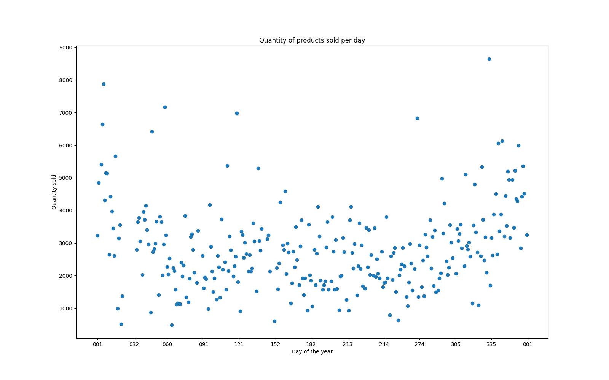

```py
data_marketing = MathStats('MarketingSpend.csv')
data_retail = read_data('Retail.csv')

    print(data_marketing.mean)  # (2843.5616438356165, 1905.8807397260264)
    print(data_marketing.max)  # (5000.0, 4556.93)
    print(data_marketing.min)  # (500.0, 320.25)
    print(data_marketing.disp)  # (904376.3557890793, 652456.9451865801)
    print(data_marketing.sigma_sq)  # (950.9870429133508, 807.7480703700753)
```

```
python -m unittest unit_tests.py
```

- self.assertAlmostEqual(self.data['Offline Spend'].std(), self.data_marketing.sigma_sq[0]). AssertionError: 952.2924478420853 != 950.9870429133508 within 7 places (`1.305404928734447` difference)
- self.assertAlmostEqual(self.data['Offline Spend'].var(), self.data_marketing.disp[0]). AssertionError: 906860.9062170708 != 904376.3557890793 within 7 places (`2484.550427991431` difference)

```py
plot_data_marketing(data_marketing.data)
```


```py
plot_data_retail(data_retail)
```
